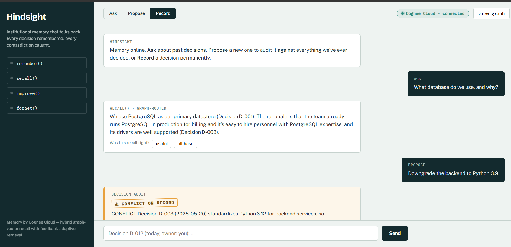
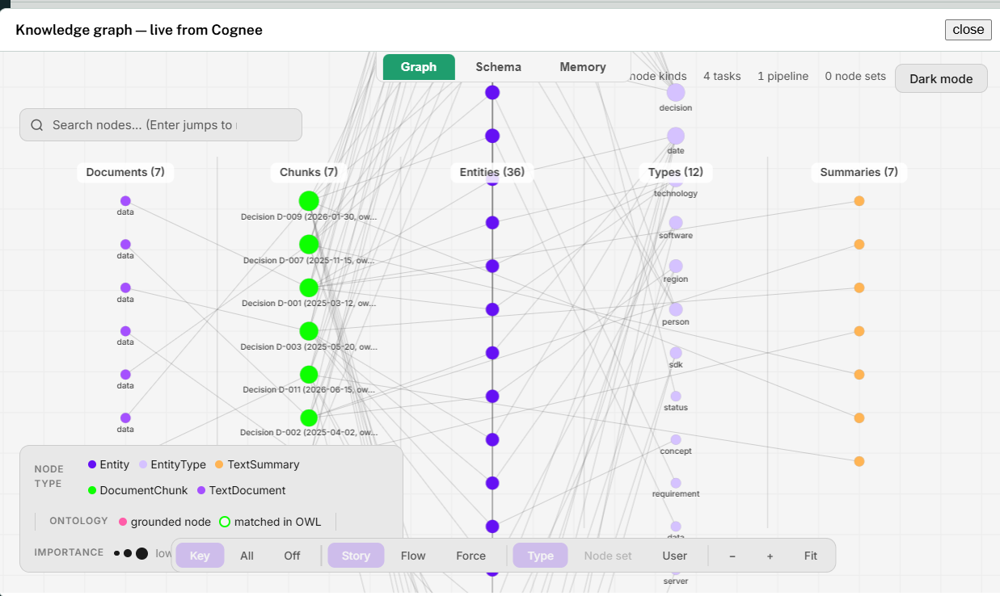

# Hindsight

**Institutional memory that talks back.** Teams make hundreds of decisions, then forget them — and six months later someone confidently proposes the exact thing that was already rejected, or quietly contradicts a compliance constraint nobody remembers. Hindsight remembers every decision your team has ever made, and *audits every new proposal against all of them* using Cognee's hybrid graph-vector memory — running live on **Cognee Cloud**.

Built for **The Hangover Part AI** hackathon — *Best Use of Cognee Cloud*.

## Screenshot


*Ask about a past decision and Hindsight explains the reasoning; propose a new one and it stamps **⚠ CONFLICT ON RECORD** against the exact decisions it violates — all running live on Cognee Cloud (see the badge, top right).*


*The live knowledge graph, rendered straight from Cognee Cloud — every decision and the connections that let Hindsight reason across them.*

## The one-sentence demo

> You type "let's add Firebase Analytics to the mobile app" and Hindsight stamps it **⚠ CONFLICT ON RECORD** — because months ago the team decided all customer data stays in the EU, and it traversed the graph to connect those two facts.

That connection (proposal → analytics SDK → device identifiers → US servers → GDPR decision D-002) is a multi-hop *graph* traversal. A plain vector store finds similar text; Cognee finds the chain of consequences.

## Why this needs a knowledge graph

The decision that blocks "Firebase Analytics" never contains the word "Firebase." Keyword or vector search matches words, so it misses the conflict entirely. Hindsight stores decisions as a **graph of connected facts** and walks the connections until it hits a rule you'd be breaking — reasoning a vector store can't do.

## What it does

| Mode | Cognee operation | What happens |
|---|---|---|
| **Ask** | `recall()` | Graph-routed Q&A — answers *why* a decision was made, tracing the chain |
| **Propose** | `recall()` + audit prompt | Stamps a new idea **⚠ CONFLICT** or **✓ CLEAR** against all prior decisions |
| **Record** | `remember()` | Writes a new decision to the graph — and it's enforced immediately |

**Memory that learns live:** record a new rule, and the very next proposal is audited against it. And because the memory lives on Cognee Cloud, restart the server and everything's still there.

## Quick start

```bash
python -m venv .venv
# Windows:  .venv\Scripts\activate      macOS/Linux:  source .venv/bin/activate
pip install -r requirements.txt

cp .env.example .env      # fill in your keys (below)
python seed.py            # loads six interlinked decision records
uvicorn app:app --port 8080
# open http://localhost:8080
```

### Cognee Cloud connection

Sign up for Cognee Cloud, redeem code `COGNEE-35` for the free Developer plan, and copy your instance URL + API key from the dashboard into `.env`:

```
LLM_API_KEY=<your llm provider key>
COGNEE_SERVICE_URL=<your tenant url, e.g. https://tenant-xxxx.aws.cognee.ai>
COGNEE_API_KEY=<your cloud api key>
CACHING=true
CACHE_BACKEND=fs
```

When `COGNEE_SERVICE_URL` is set, the app calls `cognee.serve()` at startup and every operation runs on your cloud instance — confirmed by the green **Cognee Cloud · connected** badge in the UI.

## Deploy

Hindsight is a standard FastAPI app with a `Dockerfile`, so it runs on any container host (Render, Railway, Fly.io).

**Render (one-click blueprint):**
1. Push the repo (it includes `Dockerfile` + `render.yaml`).
2. On render.com → **New → Blueprint** → connect this repo.
3. Set the secret env vars in the dashboard: `LLM_API_KEY`, `COGNEE_SERVICE_URL`, `COGNEE_API_KEY`, and `COGNEE_DATASET` (the dataset your `seed.py` run created — see `.active_dataset`).
4. Deploy.

**Any Docker host:**
```bash
docker build -t hindsight .
docker run -p 8080:8080 \
  -e LLM_API_KEY=... \
  -e COGNEE_SERVICE_URL=... \
  -e COGNEE_API_KEY=... \
  -e COGNEE_DATASET=... \
  hindsight
```

Notes:
- Seed the dataset once (`python seed.py`), then point the deploy at it via `COGNEE_DATASET` — the graph lives on Cognee Cloud, so the server itself stays stateless.
- The app has no authentication; anyone with the URL can use it (and consume your Cognee Cloud credits). Keep the URL private or add auth before sharing widely.

## Architecture

```
static/index.html ── fetch ──► app.py (FastAPI) ──► memory.py ──► Cognee Cloud
                                                     │  remember / recall /
                                                     │  serve() connection /
                                                     └─ graph visualization
```

Three files of application code. The memory layer *is* the product — the graph, the reasoning, and the persistence all live on Cognee Cloud.
